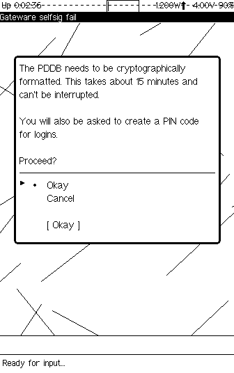
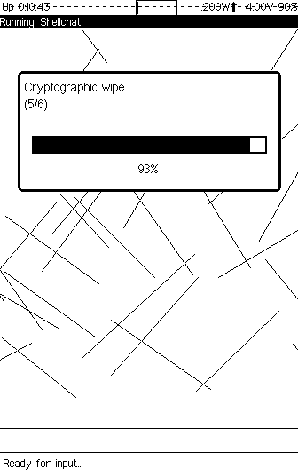
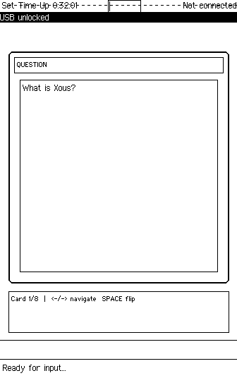

# Xous Development Toolkit

Tools and methodology for developing [Xous](https://github.com/betrusted-io/xous-core) apps on the [Precursor](https://www.crowdsupply.com/sutajio-kosagi/precursor) platform — particularly on macOS ARM64 where the Renode GUI is unavailable.

This toolkit was developed entirely through LLM-assisted development (Claude Code), bootstrapping from zero Xous knowledge to a working app running on the emulated hardware.

## What's Included

| File | Purpose |
|------|---------|
| `CLAUDE.md` | LLM agent instructions for Precursor/Xous app development |
| `discoveries.md` | API notes and hard-won discoveries from development |
| `scripts/renode_interact.py` | Low-level Renode automation (screenshots, keyboard, PDDB init) |
| `scripts/renode_capture.py` | Full app screenshot capture (boot, unlock, launch, capture all screens) |

## The Problem

Developing for Precursor on macOS ARM64 has several challenges:

1. **No GUI emulator** — Renode's XWT/GTK UI doesn't work on macOS ARM64
2. **Complex boot sequence** — PDDB initialization requires interactive PIN entry
3. **Keyboard timing quirks** — 500ms hold threshold silently drops key presses
4. **Limited documentation** — Must infer APIs from source code

## The Solution

### Headless Renode with Telnet Monitor

```bash
# Start Renode headless with telnet access
renode --disable-xwt -P 4567 \
  -e 'path add @/path/to/xous-core; i @emulation/xous-release.resc; start'
```

### Automated Interaction via Python

```bash
# Take a screenshot of the emulated display
python3 scripts/renode_interact.py screenshot output.png

# Initialize PDDB on a blank image (handles full dialog sequence)
python3 scripts/renode_interact.py init-pddb a

# Launch an app via the menu system
python3 scripts/renode_interact.py launch-app Flashcards 1

# Full sequence: boot wait + PDDB init + app launch
python3 scripts/renode_interact.py full-init 90
```

### Full App Screenshot Capture

The `renode_capture.py` script automates the complete process of booting Renode, initializing PDDB, launching an app, and capturing screenshots:

```bash
cd scripts

# First time (or when PDDB PIN unknown): full initialization
python3 renode_capture.py --init --app flashcards --screenshots ../output

# Subsequent runs (PDDB already formatted with PIN 'a'):
python3 renode_capture.py --app flashcards --screenshots ../output

# Specify app menu index (default: 1 = first app after Shellchat)
python3 renode_capture.py --app othello --app-index 1 --screenshots ../output
```

**Currently supported apps:**
- `flashcards` - Deck list, cards, study mode
- `writer` - Mode selection, editing, preview
- `othello` - Main menu, difficulty selection, gameplay

Adding new apps: Implement a `capture_<appname>()` function in `renode_capture.py`.

## Screenshots

| PDDB Format Dialog | Formatting Progress | App Running |
|---|---|---|
|  |  |  |

## Setup Guide (macOS ARM64)

### 1. Install Renode

Download the ARM64 portable package from [Renode releases](https://github.com/renode/renode/releases). Mount the DMG and copy to `/Applications/`.

```bash
# Create a convenience symlink
ln -s /Applications/Renode.app/Contents/MacOS/renode ~/bin/renode
```

### 2. Install Rust Toolchain

```bash
# Install stable Rust (tested with 1.88.0)
rustup install stable

# Download the Xous sysroot matching your Rust version
# From: https://github.com/betrusted-io/rust/releases
# Extract to:
~/.rustup/toolchains/stable-aarch64-apple-darwin/lib/rustlib/riscv32imac-unknown-xous-elf/
```

### 3. Create Flash Backing File

```bash
cd xous-core
python3 -c "
with open('tools/pddb-images/renode.bin', 'wb') as f:
    for _ in range(128):
        f.write(b'\xff' * (1024*1024))
"
```

### 4. Build and Run

```bash
# Build a Renode image with your app
cargo xtask renode-image your_app_name

# Start Renode headless
renode --disable-xwt -P 4567 \
  -e 'path add @/path/to/xous-core; i @emulation/xous-release.resc; start'

# In another terminal: initialize PDDB and launch app
python3 scripts/renode_interact.py full-init 90
```

## Screenshot Capture Troubleshooting

### Screenshots show "Incorrect PIN" dialog
**Cause:** PDDB has different PIN than expected, or was never formatted.

**Solution:** Use `--init` flag to reset and format PDDB:
```bash
python3 renode_capture.py --init --app myapp --screenshots ./output
```

### Screenshots show Shellchat instead of app
**Cause:** App not appearing in "Switch to App" menu. Usually an app registration issue.

**Solution:** Ensure app uses correct naming pattern:
```rust
const SERVER_NAME: &str = "_MyApp_";  // Underscored for xous names server
const APP_NAME: &str = "MyApp";       // Plain for GAM, must match manifest
```
The `APP_NAME` must exactly match `context_name` in `apps/manifest.json`.

### System reboots during capture (uptime jumps backwards)
**Cause:** App crash during key handling.

**Solution:** Use direct keyboard shortcuts instead of Enter for navigation. Check app's key handling code for panics.

### Keys don't work / wrong characters produced
**Cause:** Keyboard hold timing issue (>500ms emulated time between press/release).

**Solution:** Always use `timed_key()` method which pauses emulation during key press:
```python
def timed_key(key, after=1.0):
    send('pause')
    send(f'sysbus.keyboard Press {key}')
    send('emulation RunFor "0:0:0.001"')  # 1ms hold time
    send(f'sysbus.keyboard Release {key}')
    send('start')
    time.sleep(after)
```

## Critical: Keyboard Hold Timing

The single most important discovery for Renode interaction:

> The Xous keyboard service has a **500ms hold threshold**. If the emulated time between key press and release exceeds 500ms, the "hold" character variant is produced. **Many navigation keys (arrows, Home, Space) have `hold: None` — they produce NOTHING when held too long.**

**Solution:** Send Press and Release in a single socket write:

```python
# WRONG - may exceed 500ms emulated time between commands
sock.sendall(b'sysbus.keyboard Press Home\n')
time.sleep(0.05)  # Even 50ms can be too long when CPU is idle!
sock.sendall(b'sysbus.keyboard Release Home\n')

# CORRECT - single write minimizes emulated time gap
sock.sendall(b'sysbus.keyboard Press Home\nsysbus.keyboard Release Home\n')
```

## Key Scan Codes

| Key | Scan Code | Notes |
|-----|-----------|-------|
| Letters | `A` - `Z` | Lowercase unless shift active |
| Numbers | `Number0` - `Number9` | |
| Arrows | `Up`, `Down`, `Left`, `Right` | `hold: None` - timing critical! |
| Menu | `Home` | Produces '∴' (U+2234) - opens AND selects in menus |
| Enter | `Return` | Same char for all timing variants |
| Space | `Space` | `hold: None` - timing critical! |
| Backspace | `BackSpace` | |
| Shift | `ShiftL`, `ShiftR` | NOT `ShiftLeft`/`ShiftRight`! |

## CLAUDE.md — LLM Development Agent

The `CLAUDE.md` file contains comprehensive instructions for using an LLM (Claude Code) as a development agent for Precursor apps. It covers:

- Repository layout and architecture
- Hardware constraints (336x536 1-bit display, 100MHz CPU)
- GAM (Graphics Abstraction Manager) API patterns
- Text rendering with `blitstr2`
- PDDB (Plausibly Deniable DataBase) storage
- Network and TLS APIs
- Renode emulation setup and interaction
- Complete app template with all boilerplate

This file can be placed at the root of your development directory and used as context for LLM-assisted development sessions.

## Xous Character Codes for Apps

Apps receiving `rawkeys` get these Unicode characters:

| Key | Character | Unicode |
|-----|-----------|---------|
| Right arrow | `→` | U+2192 |
| Left arrow | `←` | U+2190 |
| Up arrow | `↑` | U+2191 |
| Down arrow | `↓` | U+2193 |
| Menu/Select | `∴` | U+2234 |
| Enter | `\r` | U+000D |
| Backspace | `\u{08}` | U+0008 |

**Do NOT use Apple PUA codes** (`\u{F700}`-`\u{F7FF}`) for arrow keys in Xous apps.

## License

MIT
